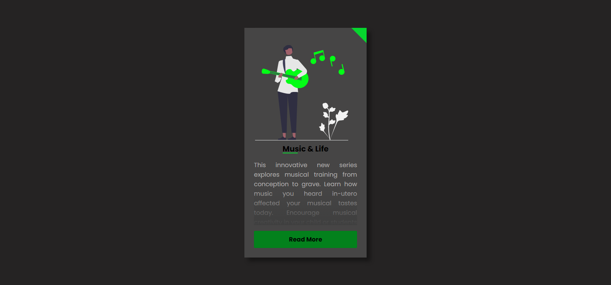

<h1 align="center"> Card </h1>

Programa gratuito, criado com aula no canal da Larissa Kich no Youtube.  

  <a href="#-tecnologias">Tecnologias</a>&nbsp;&nbsp;&nbsp;|&nbsp;&nbsp;&nbsp;
  <a href="#-projeto">Projeto</a>&nbsp;&nbsp;&nbsp;|&nbsp;&nbsp;&nbsp;
  <a href="#-layout">Layout</a>&nbsp;&nbsp;&nbsp;|&nbsp;&nbsp;&nbsp;
  <a href="#memo-licença">Licença</a>

 

  

## 🚀 Tecnologias

Esse projeto foi desenvolvido com as seguintes tecnologias:

- HTML e CSS
- JavaScript
- Git e Github
- Google Fonts
- unDraw

## 💻 Projeto

O Card é um projeto apresentado como aula no canal da Larissa Kich, que possui informações sobre algum tema, onde o texto é apresentado parcialmente e caso o leitor deseje ler mais , basta que acione o botão Ler Mais que o restante do texto será apresentado. Utilizei como aprendizado em programação.

## 🔖 Layout

O Layout pode ser conferido no canal da Larissa Kich no Youtube

## 📝 Licença

Livre

---

Feito com ♥ by Wellington Sato 👋